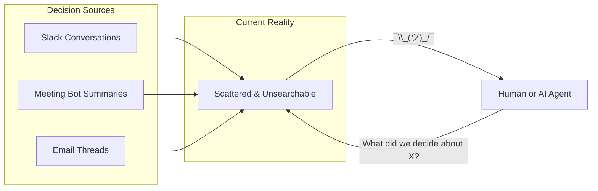
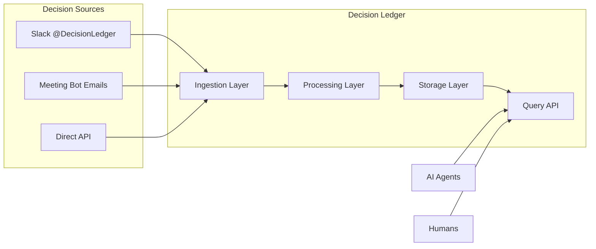
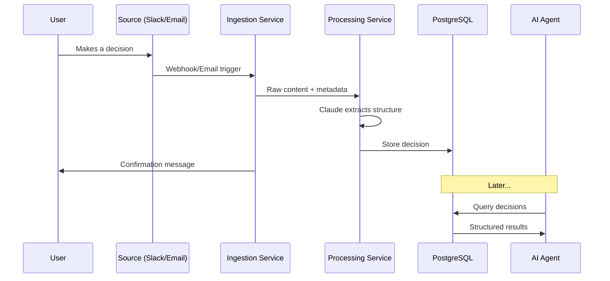
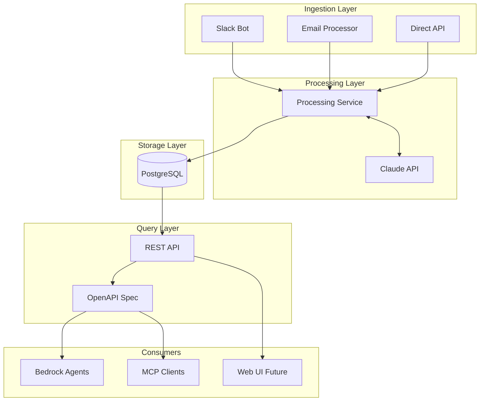
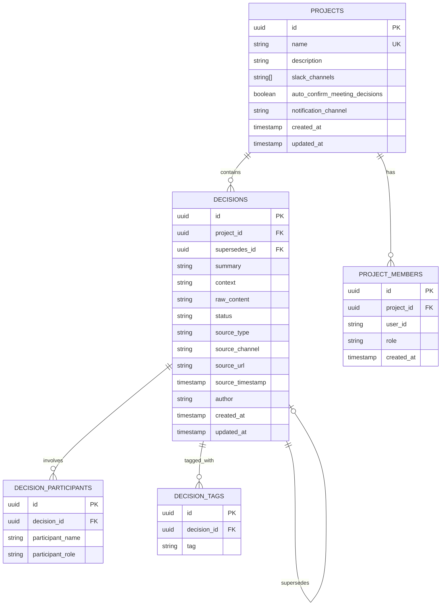
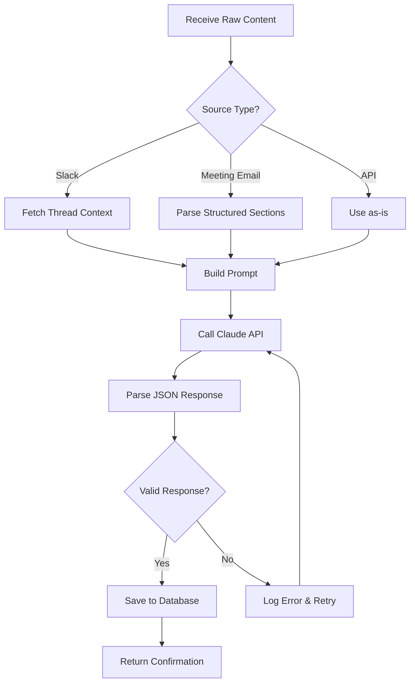
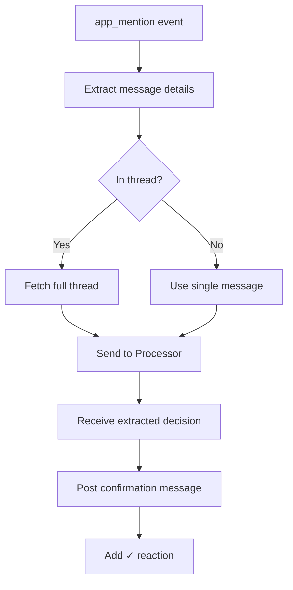
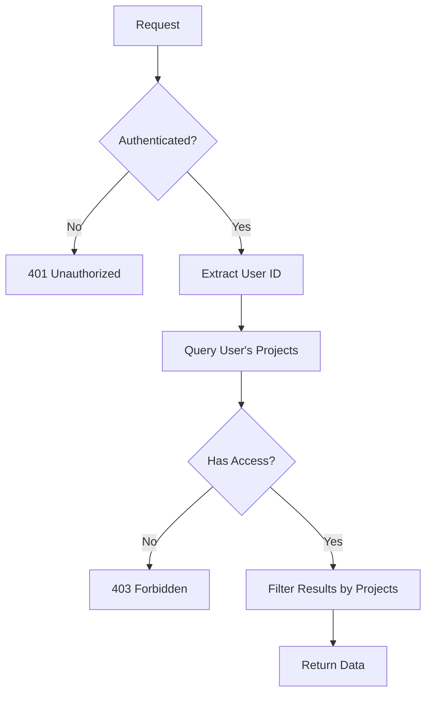
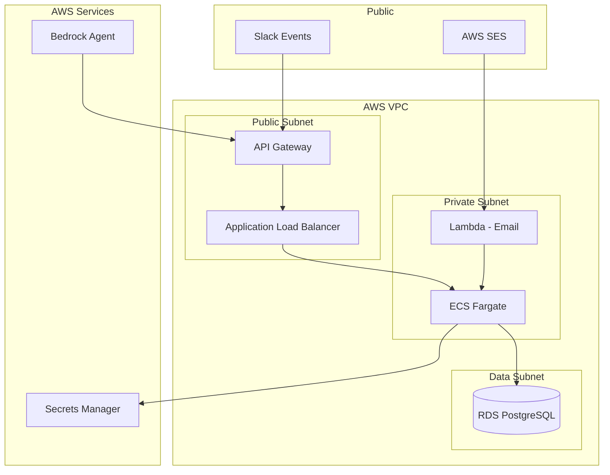

# Decision Ledger - Technical Design Document

> **Status:** Draft
> **Last Updated:** 2024-02-03
> **Author:** Aditya

---

## Table of Contents

1. [Executive Summary](#executive-summary)
2. [Problem Statement](#problem-statement)
3. [Solution Overview](#solution-overview)
4. [System Architecture](#system-architecture)
5. [Data Model](#data-model)
6. [Component Design](#component-design)
7. [API Specification](#api-specification)
8. [Security & Access Control](#security--access-control)
9. [Infrastructure](#infrastructure)
10. [Open Questions](#open-questions)

---

## Executive Summary

**Decision Ledger** is a unified knowledge base that aggregates project decisions from multiple sources (Slack, meeting summaries, email) and makes them queryable through a single API designed for AI agent consumption.

### Key Value Proposition

| Problem | Solution |
|---------|----------|
| Decisions are scattered across Slack, meetings, emails | Single aggregated knowledge base |
| Hard to find "what did we decide about X?" | Unified search API |
| AI agents can't access historical decisions | Agent-friendly REST API with OpenAPI spec |

### Core Capabilities

1. **Ingest** decisions from multiple sources (Slack bot, meeting summary emails, API)
2. **Extract** structured data using Claude (summary, participants, tags, project)
3. **Store** in PostgreSQL with full-text search
4. **Query** via REST API designed for AI agents (Bedrock, MCP, etc.)

---

## Problem Statement

### Current State



**Pain Points:**
- Decisions made in meetings are captured by meeting bot, but siloed in email
- Decisions made in Slack are lost in channel history
- No single place to query "all decisions about project X"
- AI agents have no access to institutional decision history

### Desired State



---

## Solution Overview

### How It Works



### Source-Specific Flows

#### 1. Slack Bot Flow
```
User tags @DecisionLedger in message/thread
    → Bot captures message + thread context
    → Claude extracts decision details
    → Bot replies with confirmation
    → Decision stored in database
```

#### 2. Meeting Bot Email Flow
```
Meeting bot sends summary email to decisions@yourdomain.com
    → Email service receives and parses
    → Extract "Key Decisions" section (structured)
    → Store each decision with meeting metadata
    → Optional: notify relevant Slack channel
```

#### 3. Direct API Flow
```
External service POSTs to /api/decisions
    → Validate and process
    → Claude extracts structure (if raw) or store directly (if structured)
    → Return decision ID
```

---

## System Architecture

### High-Level Architecture



### Component Overview

| Component | Purpose | Technology |
|-----------|---------|------------|
| **Slack Bot** | Capture decisions from Slack mentions | Python, slack-bolt |
| **Email Processor** | Ingest meeting bot summaries | Python, AWS SES |
| **Processing Service** | Extract structure using Claude | Python, Anthropic SDK |
| **REST API** | CRUD + Query endpoints | Python, FastAPI |
| **Database** | Persistent storage | PostgreSQL |

---

## Data Model

### Entity Relationship Diagram



### Table Definitions

#### `projects`
| Column | Type | Description |
|--------|------|-------------|
| `id` | UUID | Primary key |
| `name` | VARCHAR(255) | Unique project name |
| `description` | TEXT | Project description |
| `slack_channels` | TEXT[] | Channels that map to this project |
| `auto_confirm_meeting_decisions` | BOOLEAN | Auto-confirm decisions from meeting emails (default: false) |
| `notification_channel` | VARCHAR(255) | Slack channel for notifications (future use) |
| `created_at` | TIMESTAMP | Creation time |
| `updated_at` | TIMESTAMP | Last update time |

#### `decisions`
| Column | Type | Description |
|--------|------|-------------|
| `id` | UUID | Primary key |
| `project_id` | UUID | Foreign key to projects |
| `summary` | TEXT | LLM-extracted decision summary |
| `context` | TEXT | Surrounding context/rationale |
| `raw_content` | TEXT | Original message/email content |
| `status` | VARCHAR(20) | 'pending', 'open', 'confirmed', 'superseded' |
| `supersedes_id` | UUID | References decision this one replaces (nullable) |
| `source_type` | VARCHAR(50) | 'slack', 'email', 'meeting', 'api' |
| `source_channel` | VARCHAR(255) | Slack channel or email thread |
| `source_url` | TEXT | Link to original message |
| `source_timestamp` | TIMESTAMP | When decision was made |
| `author` | VARCHAR(255) | Who logged the decision |
| `created_at` | TIMESTAMP | Creation time |
| `updated_at` | TIMESTAMP | Last update time |

#### `decision_participants`
| Column | Type | Description |
|--------|------|-------------|
| `id` | UUID | Primary key |
| `decision_id` | UUID | Foreign key to decisions |
| `participant_name` | VARCHAR(255) | Name of participant |
| `participant_role` | VARCHAR(100) | 'decider', 'approver', 'contributor' |

#### `decision_tags`
| Column | Type | Description |
|--------|------|-------------|
| `id` | UUID | Primary key |
| `decision_id` | UUID | Foreign key to decisions |
| `tag` | VARCHAR(100) | Tag value |

#### `project_members`
| Column | Type | Description |
|--------|------|-------------|
| `id` | UUID | Primary key |
| `project_id` | UUID | Foreign key to projects |
| `user_id` | VARCHAR(255) | User identifier (Slack ID, IAM ARN) |
| `role` | VARCHAR(50) | 'admin', 'member', 'viewer' |
| `created_at` | TIMESTAMP | Creation time |

---

## Component Design

### 1. Processing Service

The processing service is the core intelligence layer that extracts structured decisions from raw content.

#### Claude Extraction Prompt

```
Given the following content from {source_type}:

Source: {source_channel}
Author: {author}
Timestamp: {timestamp}
Content:
---
{raw_content}
---

Known projects: {project_list_with_descriptions}

Extract the following (respond in JSON):
{
  "decisions": [
    {
      "summary": "One clear sentence describing what was decided",
      "context": "Why this decision was made (2-3 sentences)",
      "participants": [
        {"name": "Person Name", "role": "decider|approver|contributor"}
      ],
      "suggested_project": "Project name or NEW:Suggested Name",
      "tags": ["tag1", "tag2"]
    }
  ]
}

Rules:
- Extract ALL decisions from the content (there may be multiple)
- Summary should be actionable and specific
- If no clear decision is present, return empty decisions array
- For suggested_project, pick the best match or suggest a new one
```

#### Processing Flow



### 2. Slack Bot

#### Event Handling



#### Slack App Configuration

| Scope | Purpose |
|-------|---------|
| `app_mentions:read` | Detect @DecisionLedger mentions |
| `channels:history` | Read channel/thread messages |
| `chat:write` | Send confirmation messages |
| `reactions:write` | Add checkmark reactions |

### 3. Email Processor

#### Meeting Bot Email Parsing

Assuming the meeting bot sends structured emails:

```
Subject: Meeting Summary - Project Standup - 2024-02-03

Attendees: Alice, Bob, Charlie

Key Decisions:
• We will use PostgreSQL instead of MongoDB for the new service
• Launch date moved to March 15th
• Budget approved for contractor hire

Action Items:
• Alice: Draft database schema by Friday
• Bob: Update project timeline
```

**Parsing Strategy:**
1. Extract attendees from header
2. Find "Key Decisions" section
3. Parse each bullet as a separate decision
4. Associate with project from subject line
5. Minimal Claude usage needed (structured input)

---

## API Specification

### Endpoints Overview

| Method | Endpoint | Description |
|--------|----------|-------------|
| `GET` | `/health` | Health check |
| `GET` | `/projects` | List projects |
| `POST` | `/projects` | Create project |
| `GET` | `/projects/{id}` | Get project |
| `PUT` | `/projects/{id}` | Update project |
| `DELETE` | `/projects/{id}` | Delete project |
| `GET` | `/projects/{id}/decisions` | List project decisions |
| `GET` | `/projects/{id}/members` | List project members |
| `POST` | `/projects/{id}/members` | Add project member |
| `DELETE` | `/projects/{id}/members/{user_id}` | Remove member |
| `GET` | `/decisions` | Query decisions (excludes superseded by default) |
| `POST` | `/decisions` | Create decision |
| `GET` | `/decisions/{id}` | Get decision |
| `DELETE` | `/decisions/{id}` | Delete decision |
| `GET` | `/decisions/{id}/history` | Get decision evolution chain |
| `GET` | `/decisions/search` | Full-text search |

### Key Endpoint Details

#### `GET /decisions`

Query decisions with filters.

**Parameters:**
| Param | Type | Description |
|-------|------|-------------|
| `project_id` | UUID | Filter by project |
| `author` | string | Filter by author |
| `status` | string | Filter by status ('open', 'confirmed') |
| `source_type` | string | Filter by source ('slack', 'meeting', 'email') |
| `tags` | string[] | Filter by tags (any match) |
| `date_from` | datetime | Filter by date range start |
| `date_to` | datetime | Filter by date range end |
| `include_superseded` | boolean | Include superseded decisions (default: false) |
| `limit` | int | Max results (default 50) |
| `offset` | int | Pagination offset |

**Response:**
```json
{
  "decisions": [
    {
      "id": "uuid",
      "summary": "We decided to use PostgreSQL",
      "context": "After evaluating options...",
      "status": "confirmed",
      "project": {"id": "uuid", "name": "Backend Rewrite"},
      "source_type": "meeting",
      "source_timestamp": "2024-02-03T10:00:00Z",
      "author": "Alice",
      "tags": ["database", "infrastructure"],
      "participants": [
        {"name": "Alice", "role": "decider"},
        {"name": "Bob", "role": "approver"}
      ],
      "supersedes_id": null
    }
  ],
  "total": 100,
  "limit": 50,
  "offset": 0
}
```

#### `GET /decisions/search`

Full-text search across decision summaries and context.

**Parameters:**
| Param | Type | Description |
|-------|------|-------------|
| `q` | string | Search query |
| `project_id` | UUID | Scope to project |
| `limit` | int | Max results |

---

## Security & Access Control

### Authentication

- **API Gateway**: AWS IAM authentication
- **Bedrock Agents**: IAM roles
- **Slack Bot**: Slack signing secret verification
- **Internal Services**: IAM roles (no secrets)

### Authorization Model



**Rules:**
- Users only see decisions for projects they are members of
- Project admins can add/remove members
- All queries automatically scoped to user's projects

---

## Infrastructure

### AWS Architecture



### Local Development

```bash
docker-compose up
# Starts: PostgreSQL, API service, Slack bot
# Use ngrok for Slack webhook URL
```

---

## Open Questions

| Question | Options | Status |
|----------|---------|--------|
| Meeting bot email format | Need sample to finalize parser | **Needs Input** |
| Decision editing | Allow edits? Audit trail? | **TBD** |
| Web UI | Build simple viewer? | **Phase 2** |
| Attachments | Handle images/files? | **Deferred** |

---

## Appendix

### Tech Stack

| Component | Technology | Rationale |
|-----------|------------|-----------|
| Language | Python 3.11+ | Team familiarity, good LLM libraries |
| API | FastAPI | Async, auto OpenAPI, fast |
| Database | PostgreSQL | Reliable, full-text search, arrays |
| LLM | Claude (Anthropic) | Best at structured extraction |
| Slack | slack-bolt | Official SDK, well documented |
| Deployment | AWS ECS Fargate | Serverless containers, scales |
| Agent | AWS Bedrock | Native AWS integration |
