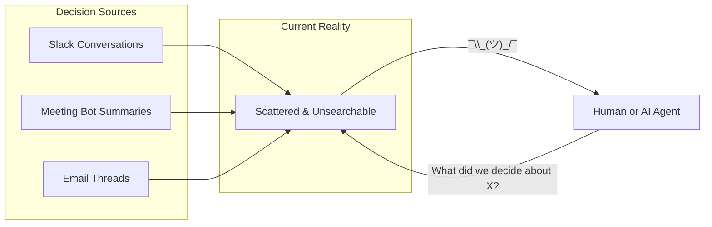
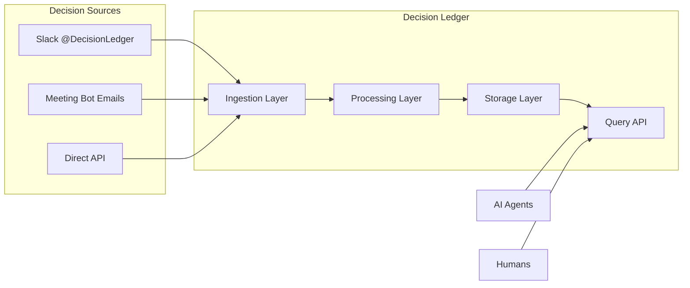
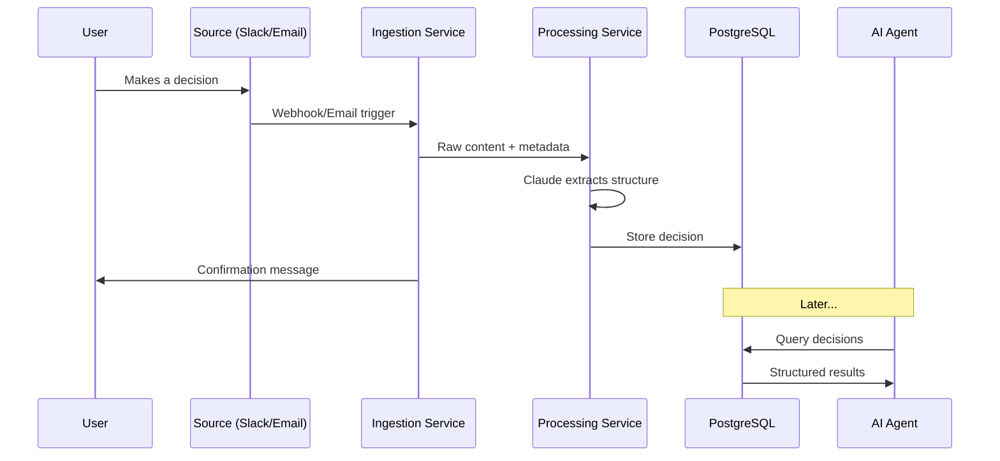
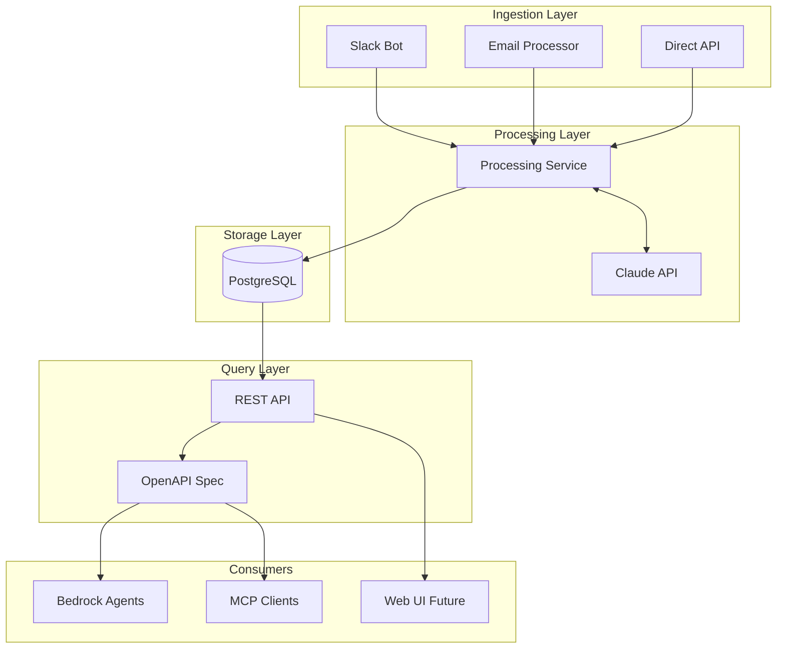
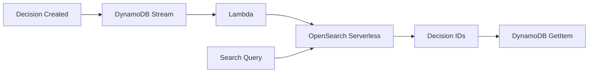
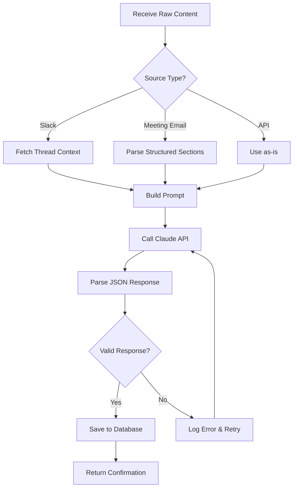
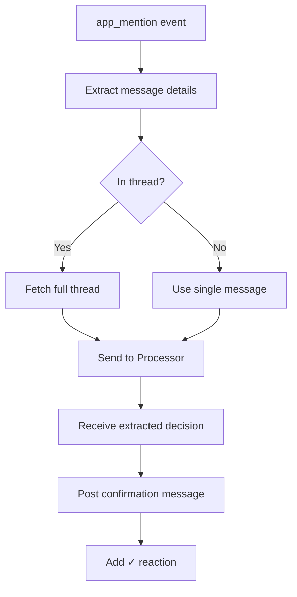
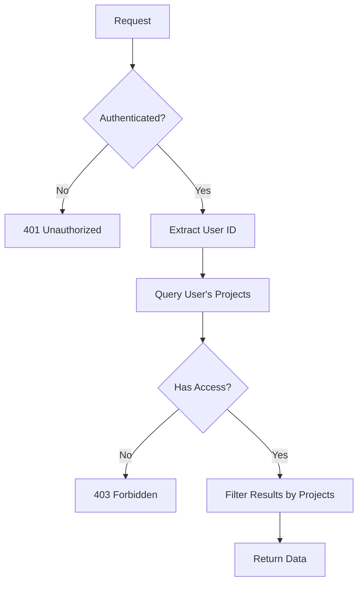
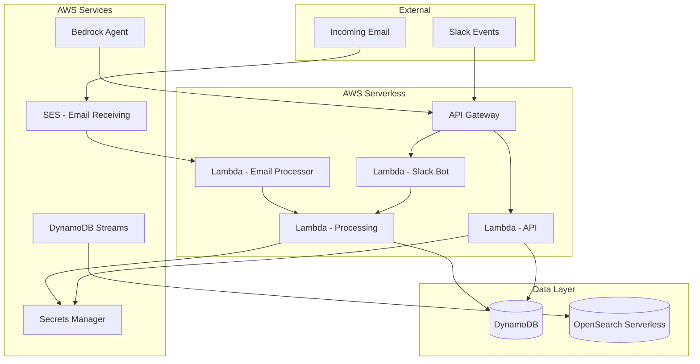

# Decision Ledger - Technical Design Document

> **Status:** Draft
> **Last Updated:** 2024-02-03
> **Author:** Aditya

---

## Table of Contents

1. [Executive Summary](#executive-summary)
2. [Problem Statement](#problem-statement)
3. [Solution Overview](#solution-overview)
4. [System Architecture](#system-architecture)
5. [Data Model](#data-model)
6. [Component Design](#component-design)
7. [API Specification](#api-specification)
8. [Security & Access Control](#security--access-control)
9. [Infrastructure](#infrastructure)
10. [Open Questions](#open-questions)

---

## Executive Summary

**Decision Ledger** is a unified knowledge base that aggregates project decisions from multiple sources (Slack, meeting summaries, email) and makes them queryable through a single API designed for AI agent consumption.

### Key Value Proposition

| Problem | Solution |
|---------|----------|
| Decisions are scattered across Slack, meetings, emails | Single aggregated knowledge base |
| Hard to find "what did we decide about X?" | Unified search API |
| AI agents can't access historical decisions | Agent-friendly REST API with OpenAPI spec |

### Core Capabilities

1. **Ingest** decisions from multiple sources (Slack bot, meeting summary emails, API)
2. **Extract** structured data using Claude (summary, participants, tags, project)
3. **Store** in PostgreSQL with full-text search
4. **Query** via REST API designed for AI agents (Bedrock, MCP, etc.)

---

## Problem Statement

### Current State



**Pain Points:**
- Decisions made in meetings are captured by meeting bot, but siloed in email
- Decisions made in Slack are lost in channel history
- No single place to query "all decisions about project X"
- AI agents have no access to institutional decision history

### Desired State



---

## Solution Overview

### How It Works



### Source-Specific Flows

#### 1. Slack Bot Flow
```
User tags @DecisionLedger in message/thread
    → Bot captures message + thread context
    → Claude extracts decision details
    → Bot replies with confirmation
    → Decision stored in database
```

#### 2. Meeting Bot Email Flow
```
Meeting bot sends summary email to decisions@yourdomain.com
    → Email service receives and parses
    → Extract "Key Decisions" section (structured)
    → Store each decision with meeting metadata
    → Optional: notify relevant Slack channel
```

#### 3. Direct API Flow
```
External service POSTs to /api/decisions
    → Validate and process
    → Claude extracts structure (if raw) or store directly (if structured)
    → Return decision ID
```

---

## System Architecture

### High-Level Architecture



### Component Overview

| Component | Purpose | Technology |
|-----------|---------|------------|
| **Slack Bot** | Capture decisions from Slack mentions | Python, slack-bolt, Lambda |
| **Email Processor** | Ingest meeting bot summaries | Lambda, AWS SES |
| **Processing Service** | Extract structure using Claude | Lambda, Bedrock/Anthropic SDK |
| **REST API** | CRUD + Query endpoints | API Gateway, Lambda |
| **Database** | Persistent storage | DynamoDB |
| **Search** | Full-text search (Phase 2) | OpenSearch Serverless |

---

## Data Model

### Database Choice: DynamoDB

**Decision:** Use Amazon DynamoDB instead of PostgreSQL.

**Rationale:**
- Fully serverless - no capacity management, automatic scaling
- Pay-per-request pricing - cost-effective for variable workloads
- Native AWS integration - seamless IAM, Lambda, API Gateway integration
- Single-digit millisecond latency at any scale
- No connection pooling complexity

**Trade-offs accepted:**
- Denormalized data model (duplicated data for query efficiency)
- Access patterns must be designed upfront
- Full-text search requires OpenSearch Serverless integration
- No joins - multiple queries or denormalization required

### Access Patterns

DynamoDB requires designing for access patterns first. Here are our primary patterns:

| # | Access Pattern | Key Design |
|---|----------------|------------|
| AP1 | Get project by ID | PK=`PROJECT#<id>` |
| AP2 | List user's projects | GSI1: `user_id` → projects |
| AP3 | Get decision by ID | PK=`DECISION#<id>` |
| AP4 | List decisions by project | GSI2: `project_id`, SK=`created_at` |
| AP5 | List decisions by status | GSI3: `status`, SK=`created_at` |
| AP6 | Get decision history chain | Query by `supersedes_id` |
| AP7 | Search decisions by text | OpenSearch Serverless |
| AP8 | List project members | PK=`PROJECT#<id>`, SK=`MEMBER#<user_id>` |
| AP9 | Check user membership | GSI1: `user_id` |

### Table Design (Single-Table)

Using single-table design for efficient queries and reduced costs.

**Table Name:** `decision-ledger`

```
┌─────────────────────────────────────────────────────────────────────────────┐
│ PK                    │ SK                  │ Attributes                    │
├─────────────────────────────────────────────────────────────────────────────┤
│ PROJECT#<id>          │ METADATA            │ name, description, settings   │
│ PROJECT#<id>          │ MEMBER#<user_id>    │ role, joined_at               │
├─────────────────────────────────────────────────────────────────────────────┤
│ DECISION#<id>         │ METADATA            │ summary, status, project_id   │
│ DECISION#<id>         │ PARTICIPANT#<name>  │ role                          │
│ DECISION#<id>         │ TAG#<tag>           │ (tag stored in SK)            │
└─────────────────────────────────────────────────────────────────────────────┘
```

### Global Secondary Indexes (GSIs)

| GSI | Partition Key | Sort Key | Purpose |
|-----|---------------|----------|---------|
| GSI1 | `user_id` | `entity_type` | List user's project memberships |
| GSI2 | `project_id` | `created_at` | List decisions by project |
| GSI3 | `gsi3_pk` (status#project) | `created_at` | Filter by status within project |
| GSI4 | `supersedes_id` | - | Find superseding decision |

### Entity Schemas

#### Project Entity
```json
{
  "PK": "PROJECT#<uuid>",
  "SK": "METADATA",
  "entity_type": "PROJECT",
  "id": "<uuid>",
  "name": "Backend Rewrite",
  "description": "Project description",
  "slack_channels": ["#backend", "#engineering"],
  "auto_confirm_meeting_decisions": false,
  "notification_channel": "#backend-decisions",
  "created_at": "2024-02-03T10:00:00Z",
  "updated_at": "2024-02-03T10:00:00Z"
}
```

#### Project Member Entity
```json
{
  "PK": "PROJECT#<project_uuid>",
  "SK": "MEMBER#<user_id>",
  "entity_type": "PROJECT_MEMBER",
  "user_id": "U12345678",
  "project_id": "<project_uuid>",
  "role": "admin",
  "created_at": "2024-02-03T10:00:00Z"
}
```

#### Decision Entity
```json
{
  "PK": "DECISION#<uuid>",
  "SK": "METADATA",
  "entity_type": "DECISION",
  "id": "<uuid>",
  "project_id": "<project_uuid>",
  "summary": "Use PostgreSQL for the new service",
  "context": "After evaluating MongoDB and PostgreSQL...",
  "raw_content": "Original slack message or email content",
  "status": "confirmed",
  "supersedes_id": null,
  "source_type": "slack",
  "source_channel": "#backend",
  "source_url": "https://slack.com/archives/...",
  "source_timestamp": "2024-02-03T09:30:00Z",
  "author": "U12345678",
  "participants": [
    {"name": "Alice", "role": "decider"},
    {"name": "Bob", "role": "approver"}
  ],
  "tags": ["database", "infrastructure"],
  "created_at": "2024-02-03T10:00:00Z",
  "updated_at": "2024-02-03T10:00:00Z",
  "gsi3_pk": "confirmed#<project_uuid>"
}
```

**Note:** Participants and tags are embedded in the decision document for read efficiency. For large numbers of participants/tags, separate items could be used.

### Full-Text Search: OpenSearch Serverless

DynamoDB doesn't support full-text search natively. For the `/decisions/search` endpoint:



**Implementation:**
1. DynamoDB Streams triggers Lambda on decision changes
2. Lambda indexes decision summary + context in OpenSearch
3. Search queries hit OpenSearch, return decision IDs
4. Full decision fetched from DynamoDB

**Alternative (simpler, Phase 1):** Skip OpenSearch, use Claude to search through filtered results. Add OpenSearch in Phase 2 if needed.

---

## Component Design

### 1. Processing Service

The processing service is the core intelligence layer that extracts structured decisions from raw content.

#### Claude Extraction Prompt

```
Given the following content from {source_type}:

Source: {source_channel}
Author: {author}
Timestamp: {timestamp}
Content:
---
{raw_content}
---

Known projects: {project_list_with_descriptions}

Extract the following (respond in JSON):
{
  "decisions": [
    {
      "summary": "One clear sentence describing what was decided",
      "context": "Why this decision was made (2-3 sentences)",
      "participants": [
        {"name": "Person Name", "role": "decider|approver|contributor"}
      ],
      "suggested_project": "Project name or NEW:Suggested Name",
      "tags": ["tag1", "tag2"]
    }
  ]
}

Rules:
- Extract ALL decisions from the content (there may be multiple)
- Summary should be actionable and specific
- If no clear decision is present, return empty decisions array
- For suggested_project, pick the best match or suggest a new one
```

#### Processing Flow



### 2. Slack Bot

#### Event Handling



#### Slack App Configuration

| Scope | Purpose |
|-------|---------|
| `app_mentions:read` | Detect @DecisionLedger mentions |
| `channels:history` | Read channel/thread messages |
| `chat:write` | Send confirmation messages |
| `reactions:write` | Add checkmark reactions |

### 3. Email Processor

#### Meeting Bot Email Parsing

Assuming the meeting bot sends structured emails:

```
Subject: Meeting Summary - Project Standup - 2024-02-03

Attendees: Alice, Bob, Charlie

Key Decisions:
• We will use PostgreSQL instead of MongoDB for the new service
• Launch date moved to March 15th
• Budget approved for contractor hire

Action Items:
• Alice: Draft database schema by Friday
• Bob: Update project timeline
```

**Parsing Strategy:**
1. Extract attendees from header
2. Find "Key Decisions" section
3. Parse each bullet as a separate decision
4. Associate with project from subject line
5. Minimal Claude usage needed (structured input)

---

## API Specification

### Endpoints Overview

| Method | Endpoint | Description |
|--------|----------|-------------|
| `GET` | `/health` | Health check |
| `GET` | `/projects` | List projects |
| `POST` | `/projects` | Create project |
| `GET` | `/projects/{id}` | Get project |
| `PUT` | `/projects/{id}` | Update project |
| `DELETE` | `/projects/{id}` | Delete project |
| `GET` | `/projects/{id}/decisions` | List project decisions |
| `GET` | `/projects/{id}/members` | List project members |
| `POST` | `/projects/{id}/members` | Add project member |
| `DELETE` | `/projects/{id}/members/{user_id}` | Remove member |
| `GET` | `/decisions` | Query decisions (excludes superseded by default) |
| `POST` | `/decisions` | Create decision |
| `GET` | `/decisions/{id}` | Get decision |
| `DELETE` | `/decisions/{id}` | Delete decision |
| `GET` | `/decisions/{id}/history` | Get decision evolution chain |
| `GET` | `/decisions/search` | Full-text search |

### Key Endpoint Details

#### `GET /decisions`

Query decisions with filters.

**Parameters:**
| Param | Type | Description |
|-------|------|-------------|
| `project_id` | UUID | Filter by project |
| `author` | string | Filter by author |
| `status` | string | Filter by status ('open', 'confirmed') |
| `source_type` | string | Filter by source ('slack', 'meeting', 'email') |
| `tags` | string[] | Filter by tags (any match) |
| `date_from` | datetime | Filter by date range start |
| `date_to` | datetime | Filter by date range end |
| `include_superseded` | boolean | Include superseded decisions (default: false) |
| `limit` | int | Max results (default 50) |
| `offset` | int | Pagination offset |

**Response:**
```json
{
  "decisions": [
    {
      "id": "uuid",
      "summary": "We decided to use PostgreSQL",
      "context": "After evaluating options...",
      "status": "confirmed",
      "project": {"id": "uuid", "name": "Backend Rewrite"},
      "source_type": "meeting",
      "source_timestamp": "2024-02-03T10:00:00Z",
      "author": "Alice",
      "tags": ["database", "infrastructure"],
      "participants": [
        {"name": "Alice", "role": "decider"},
        {"name": "Bob", "role": "approver"}
      ],
      "supersedes_id": null
    }
  ],
  "total": 100,
  "limit": 50,
  "offset": 0
}
```

#### `GET /decisions/search`

Full-text search across decision summaries and context.

**Parameters:**
| Param | Type | Description |
|-------|------|-------------|
| `q` | string | Search query |
| `project_id` | UUID | Scope to project |
| `limit` | int | Max results |

---

## Security & Access Control

### Authentication

- **API Gateway**: AWS IAM authentication
- **Bedrock Agents**: IAM roles
- **Slack Bot**: Slack signing secret verification
- **Internal Services**: IAM roles (no secrets)

### Authorization Model



**Rules:**
- Users only see decisions for projects they are members of
- Project admins can add/remove members
- All queries automatically scoped to user's projects

---

## Infrastructure

### AWS Architecture (Serverless)



### Why Serverless?

| Aspect | Benefit |
|--------|---------|
| **Cost** | Pay only for actual usage, no idle costs |
| **Scale** | Automatic scaling from 0 to thousands of requests |
| **Operations** | No servers to manage, patch, or monitor |
| **Integration** | Native AWS service integration via IAM |

### Local Development

```bash
# Start DynamoDB Local
docker-compose up -d dynamodb-local dynamodb-init

# Option 1: Use SAM CLI for Lambda testing
sam local start-api

# Option 2: Use LocalStack (full AWS emulation)
docker-compose --profile localstack up -d

# Slack testing requires ngrok
ngrok http 3000
```

### Infrastructure as Code (CDK)

Using AWS CDK with TypeScript for infrastructure definitions.

```bash
cd infrastructure
npm install
cdk synth    # Generate CloudFormation
cdk deploy   # Deploy to AWS
```

**Why CDK over SAM/Terraform:**
- Type-safe infrastructure definitions
- Reusable constructs and patterns
- Native AWS integration
- Single language for infra + Lambda code (if using TypeScript)

---

## Open Questions

| Question | Options | Status |
|----------|---------|--------|
| Meeting bot email format | Need sample to finalize parser | **Needs Input** |
| Decision editing | Allow edits? Audit trail? | **TBD** |
| Web UI | Build simple viewer? | **Phase 2** |
| Attachments | Handle images/files? | **Deferred** |

---

## Appendix

### Tech Stack (AWS-Native)

| Component | Technology | Rationale |
|-----------|------------|-----------|
| Language | Python 3.11+ | Team familiarity, good LLM libraries |
| API | API Gateway + Lambda | Serverless, auto-scaling, pay-per-request |
| Database | DynamoDB | Serverless, single-digit ms latency, scales infinitely |
| Search | OpenSearch Serverless | Full-text search (Phase 2) |
| LLM | Amazon Bedrock (Claude) | AWS-native, no API key management |
| Slack | slack-bolt + Lambda | Official SDK on serverless |
| Email | SES + Lambda | Native email receiving |
| Secrets | Secrets Manager | Secure credential storage |
| IaC | AWS CDK (TypeScript) | Infrastructure as code |
| Agent | AWS Bedrock Agent | Native integration with Decision Ledger API |

### Cost Estimation (Serverless)

| Service | Pricing Model | Estimated Monthly* |
|---------|---------------|-------------------|
| DynamoDB | Per request + storage | $5-20 |
| Lambda | Per invocation + duration | $5-15 |
| API Gateway | Per request | $3-10 |
| Bedrock (Claude) | Per token | Usage-based |
| Secrets Manager | Per secret + API calls | $1-2 |

*Estimates for low-medium usage (~10K decisions/month)
