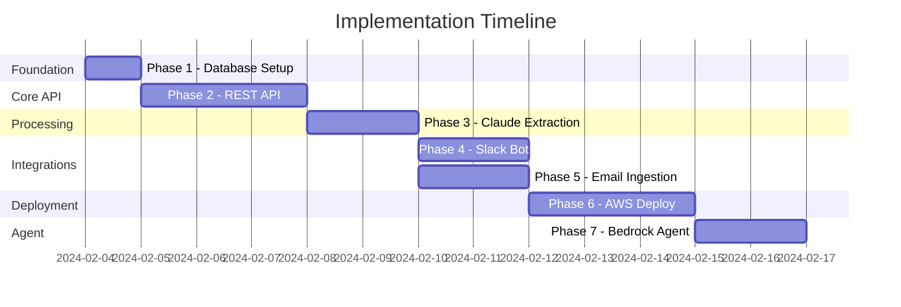

# Decision Ledger - Implementation Plan

> **Status:** Ready for Implementation
> **Last Updated:** 2024-02-03

---

## Overview

This document outlines the phased implementation plan for Decision Ledger. Each phase builds on the previous and includes clear deliverables and acceptance criteria.

---

## Phase Summary

| Phase | Name | Description | Dependencies |
|-------|------|-------------|--------------|
| 1 | Foundation | Database + Docker setup | None |
| 2 | Core API | REST API for projects & decisions | Phase 1 |
| 3 | Processing | Claude extraction service | Phase 2 |
| 4 | Slack Bot | Slack integration | Phase 2, 3 |
| 5 | Email Ingestion | Meeting bot email parser | Phase 2, 3 |
| 6 | Deployment | AWS infrastructure | Phase 1-5 |
| 7 | Agent Integration | Bedrock Agent setup | Phase 6 |

---

## Phase 1: Foundation

**Goal:** Set up database schema and local development environment.

### Tasks

| # | Task | Deliverable |
|---|------|-------------|
| 1.1 | Create PostgreSQL schema | `database/migrations/001_initial_schema.sql` |
| 1.2 | Set up Docker Compose | `docker-compose.yml` with PostgreSQL |
| 1.3 | Create seed data script | `database/seed.sql` for testing |
| 1.4 | Verify local setup | Database running, schema applied |

### Acceptance Criteria

- [ ] `docker-compose up` starts PostgreSQL
- [ ] Schema creates all tables with correct relationships
- [ ] Seed data loads without errors
- [ ] Can connect and query from local machine

### Deliverables

```
database/
├── migrations/
│   └── 001_initial_schema.sql
└── seed.sql
```

---

## Phase 2: Core API

**Goal:** Build REST API with full CRUD operations for projects and decisions.

### Tasks

| # | Task | Deliverable |
|---|------|-------------|
| 2.1 | Set up FastAPI project | `services/api/src/main.py` |
| 2.2 | Configure database connection | `services/api/src/db/database.py` |
| 2.3 | Create Pydantic models | `services/api/src/models/*.py` |
| 2.4 | Implement project endpoints | `services/api/src/routes/projects.py` |
| 2.5 | Implement decision endpoints | `services/api/src/routes/decisions.py` |
| 2.6 | Implement search endpoint | Full-text search in decisions |
| 2.7 | Add health check | `/health` endpoint |
| 2.8 | Generate OpenAPI spec | Auto-generated via FastAPI |

### API Endpoints

#### Projects
| Method | Endpoint | Status |
|--------|----------|--------|
| POST | `/projects` | To implement |
| GET | `/projects` | To implement |
| GET | `/projects/{id}` | To implement |
| PUT | `/projects/{id}` | To implement |
| DELETE | `/projects/{id}` | To implement |
| GET | `/projects/{id}/decisions` | To implement |
| GET | `/projects/{id}/members` | To implement |
| POST | `/projects/{id}/members` | To implement |
| DELETE | `/projects/{id}/members/{user_id}` | To implement |

#### Decisions
| Method | Endpoint | Status |
|--------|----------|--------|
| POST | `/decisions` | To implement |
| GET | `/decisions` | To implement |
| GET | `/decisions/{id}` | To implement |
| PUT | `/decisions/{id}` | To implement |
| DELETE | `/decisions/{id}` | To implement |
| GET | `/decisions/search` | To implement |

### Acceptance Criteria

- [ ] All endpoints return correct status codes
- [ ] Pydantic validation on all inputs
- [ ] Database operations work correctly
- [ ] OpenAPI spec accessible at `/docs`
- [ ] Full-text search returns relevant results

### Deliverables

```
services/api/
├── Dockerfile
├── requirements.txt
└── src/
    ├── main.py
    ├── db/
    │   ├── __init__.py
    │   └── database.py
    ├── models/
    │   ├── __init__.py
    │   ├── project.py
    │   └── decision.py
    └── routes/
        ├── __init__.py
        ├── projects.py
        └── decisions.py
```

---

## Phase 3: Processing Service

**Goal:** Build Claude-powered extraction service to convert raw content into structured decisions.

### Tasks

| # | Task | Deliverable |
|---|------|-------------|
| 3.1 | Set up Anthropic SDK | `services/processor/requirements.txt` |
| 3.2 | Create extraction prompts | `services/processor/src/prompts.py` |
| 3.3 | Build extractor function | `services/processor/src/extractor.py` |
| 3.4 | Handle multiple decisions | Parse array responses |
| 3.5 | Project suggestion logic | Match to existing projects |
| 3.6 | Add retry logic | Handle API failures |

### Extraction Flow

```
Input: {
    source_type: "slack" | "meeting" | "email" | "api",
    source_channel: string,
    author: string,
    raw_content: string,
    timestamp: datetime
}

Output: {
    decisions: [{
        summary: string,
        context: string,
        participants: [{name, role}],
        suggested_project: string,
        tags: string[]
    }]
}
```

### Acceptance Criteria

- [ ] Extracts decisions from Slack message format
- [ ] Extracts decisions from meeting summary format
- [ ] Handles content with no clear decisions (returns empty array)
- [ ] Suggests appropriate existing project
- [ ] Handles API rate limits and errors

### Deliverables

```
services/processor/
├── requirements.txt
└── src/
    ├── __init__.py
    ├── extractor.py
    └── prompts.py
```

---

## Phase 4: Slack Bot

**Goal:** Build Slack bot that captures decisions when mentioned.

### Prerequisites

- [ ] Slack App created at api.slack.com
- [ ] Bot token and signing secret obtained
- [ ] Event subscriptions configured

### Tasks

| # | Task | Deliverable |
|---|------|-------------|
| 4.1 | Set up slack-bolt app | `services/slack-bot/src/app.py` |
| 4.2 | Handle `app_mention` event | Capture mention context |
| 4.3 | Fetch thread context | Get full thread if in thread |
| 4.4 | Call processing service | Send content for extraction |
| 4.5 | Post confirmation | Reply with extracted decision |
| 4.6 | Add reaction | ✓ on original message |
| 4.7 | Handle errors gracefully | User-friendly error messages |

### Bot Commands

| Trigger | Action |
|---------|--------|
| `@DecisionLedger` (in message) | Log the message as a decision |
| `@DecisionLedger` (in thread) | Log the full thread as context |

### Acceptance Criteria

- [ ] Bot responds to mentions
- [ ] Thread context is captured when applicable
- [ ] Confirmation message shows extracted summary
- [ ] Checkmark reaction added on success
- [ ] Errors don't crash the bot

### Deliverables

```
services/slack-bot/
├── Dockerfile
├── requirements.txt
└── src/
    ├── __init__.py
    ├── app.py
    └── handlers/
        ├── __init__.py
        └── mentions.py
```

---

## Phase 5: Email Ingestion

**Goal:** Parse meeting bot summary emails and ingest decisions.

### Prerequisites

- [ ] Sample meeting bot email format provided
- [ ] Email receiving infrastructure (SES or similar)

### Tasks

| # | Task | Deliverable |
|---|------|-------------|
| 5.1 | Create email parser | `services/processor/src/email_parser.py` |
| 5.2 | Extract attendees | Parse attendee list |
| 5.3 | Extract decisions section | Find and parse "Key Decisions" |
| 5.4 | Extract project from subject | Map to existing project |
| 5.5 | Create ingestion endpoint | POST `/ingest/email` |
| 5.6 | Set up SES integration | Lambda trigger for incoming email |

### Email Format (Expected)

```
Subject: Meeting Summary - {Project Name} - {Date}

Attendees: {comma-separated names}

Key Decisions:
• {decision 1}
• {decision 2}

Action Items:
• {item 1}
```

### Acceptance Criteria

- [ ] Parses standard meeting bot format
- [ ] Each bullet becomes a separate decision
- [ ] Project associated from subject line
- [ ] Attendees become participants
- [ ] Handles missing sections gracefully

### Deliverables

```
services/processor/src/
├── email_parser.py
└── ... (existing files)
```

---

## Phase 6: AWS Deployment

**Goal:** Deploy all services to AWS.

### Infrastructure Components

| Component | AWS Service | Purpose |
|-----------|-------------|---------|
| Database | RDS PostgreSQL | Persistent storage |
| API | ECS Fargate | Run API container |
| Slack Bot | Lambda or Fargate | Handle Slack events |
| Email | SES + Lambda | Receive meeting emails |
| Secrets | Secrets Manager | Store credentials |
| Load Balancer | ALB | Route traffic |
| API Gateway | API Gateway | Slack webhook URL |

### Tasks

| # | Task | Deliverable |
|---|------|-------------|
| 6.1 | Create RDS instance | PostgreSQL in private subnet |
| 6.2 | Create ECR repository | Store Docker images |
| 6.3 | Create ECS cluster | Fargate cluster |
| 6.4 | Deploy API service | ECS service + ALB |
| 6.5 | Deploy Slack bot | Lambda or ECS |
| 6.6 | Configure SES | Email receiving |
| 6.7 | Set up Secrets Manager | Store tokens |
| 6.8 | Configure API Gateway | Public endpoints |

### Acceptance Criteria

- [ ] API accessible via HTTPS
- [ ] Slack bot responds in production workspace
- [ ] Emails processed and decisions stored
- [ ] Secrets not exposed in code/logs
- [ ] Database backed up

---

## Phase 7: Agent Integration

**Goal:** Make decisions queryable by AI agents via Bedrock.

### Tasks

| # | Task | Deliverable |
|---|------|-------------|
| 7.1 | Create Bedrock Agent | Agent configuration |
| 7.2 | Upload OpenAPI spec | Action group schema |
| 7.3 | Create Lambda functions | API proxy |
| 7.4 | Configure agent instructions | System prompt |
| 7.5 | Test agent queries | Verify responses |

### Agent Tools

| Tool | Description |
|------|-------------|
| `list_projects` | Get all projects user has access to |
| `get_project_decisions` | Get decisions for a specific project |
| `search_decisions` | Search decisions by query |
| `get_decision` | Get full details of a decision |

### Acceptance Criteria

- [ ] Agent can list projects
- [ ] Agent can search decisions
- [ ] Agent can answer "what did we decide about X?"
- [ ] Access control respected

---

## Implementation Order



---

## Testing Strategy

### Unit Tests
- Extraction prompt parsing
- Email format parsing
- API endpoint handlers

### Integration Tests
- Database operations
- Claude API integration
- Slack event handling

### End-to-End Tests
- Full Slack mention → decision stored flow
- Full email → decision stored flow
- Agent query → correct response flow

---

## Risk Mitigation

| Risk | Mitigation |
|------|------------|
| Slack API rate limits | Implement exponential backoff |
| Claude API failures | Retry with backoff, queue for later |
| Meeting bot format changes | Configurable parser, fallback to Claude |
| Database connection issues | Connection pooling, health checks |

---

## Success Metrics

| Metric | Target |
|--------|--------|
| Decision capture rate | >90% of @mentions result in stored decision |
| Extraction accuracy | >85% of summaries rated "accurate" by users |
| API response time | <500ms for queries |
| Agent answer quality | Agent finds relevant decisions >80% of time |
