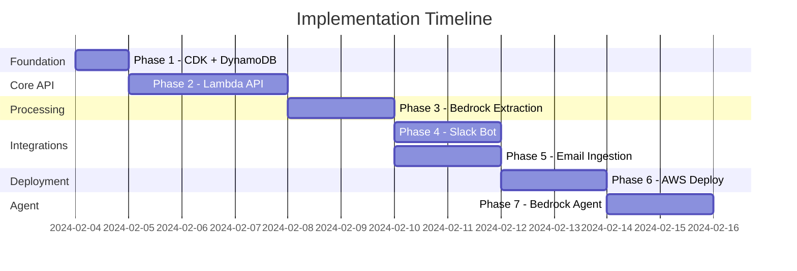

# Decision Ledger - Implementation Plan

> **Status:** Ready for Implementation
> **Last Updated:** 2024-02-04

---

## Overview

This document outlines the phased implementation plan for Decision Ledger. Each phase builds on the previous and includes clear deliverables and acceptance criteria.

**Tech Stack:** AWS Serverless (DynamoDB, Lambda, API Gateway, CDK)

---

## Phase Summary

| Phase | Name | Description | Dependencies |
|-------|------|-------------|--------------|
| 1 | Foundation | CDK setup + DynamoDB table | None |
| 2 | Core API | Lambda functions for projects & decisions | Phase 1 |
| 3 | Processing | Claude extraction via Bedrock | Phase 2 |
| 4 | Slack Bot | Slack integration via Lambda | Phase 2, 3 |
| 5 | Email Ingestion | Meeting bot email parser via SES | Phase 2, 3 |
| 6 | Deployment | Production deployment | Phase 1-5 |
| 7 | Agent Integration | Bedrock Agent setup | Phase 6 |

---

## Phase 1: Foundation

**Goal:** Set up CDK infrastructure and DynamoDB table with local development environment.

### Tasks

| # | Task | Deliverable |
|---|------|-------------|
| 1.1 | Initialize CDK project | `infrastructure/` with TypeScript CDK |
| 1.2 | Define DynamoDB table | Table with GSIs in CDK |
| 1.3 | Set up Docker Compose | `docker-compose.yml` with DynamoDB Local |
| 1.4 | Create seed data script | Python script to populate test data |
| 1.5 | Verify local setup | DynamoDB Local running, table created |

### Acceptance Criteria

- [ ] `docker-compose up` starts DynamoDB Local
- [ ] CDK synth generates valid CloudFormation
- [ ] Table created with all 4 GSIs
- [ ] Seed data loads without errors
- [ ] Can query data from local machine

### Deliverables

```
infrastructure/
├── bin/
│   └── decision-ledger.ts
├── lib/
│   └── decision-ledger-stack.ts
├── package.json
├── tsconfig.json
└── cdk.json

scripts/
└── seed_data.py
```

---

## Phase 2: Core API

**Goal:** Build Lambda functions with API Gateway for projects and decisions CRUD.

### Tasks

| # | Task | Deliverable |
|---|------|-------------|
| 2.1 | Set up Lambda project structure | `services/api/` with Python |
| 2.2 | Create DynamoDB client wrapper | `services/api/src/db/dynamodb.py` |
| 2.3 | Create Pydantic models | `services/api/src/models/*.py` |
| 2.4 | Implement project handlers | `services/api/src/handlers/projects.py` |
| 2.5 | Implement decision handlers | `services/api/src/handlers/decisions.py` |
| 2.6 | Implement history endpoint | Decision chain traversal |
| 2.7 | Add health check | `/health` endpoint |
| 2.8 | Define API Gateway in CDK | REST API with Lambda integrations |

### API Endpoints

#### Projects
| Method | Endpoint | Status |
|--------|----------|--------|
| POST | `/projects` | To implement |
| GET | `/projects` | To implement |
| GET | `/projects/{id}` | To implement |
| PUT | `/projects/{id}` | To implement |
| DELETE | `/projects/{id}` | To implement |
| GET | `/projects/{id}/decisions` | To implement |
| GET | `/projects/{id}/members` | To implement |
| POST | `/projects/{id}/members` | To implement |
| DELETE | `/projects/{id}/members/{user_id}` | To implement |

#### Decisions
| Method | Endpoint | Status |
|--------|----------|--------|
| POST | `/decisions` | To implement |
| GET | `/decisions` | To implement |
| GET | `/decisions/{id}` | To implement |
| DELETE | `/decisions/{id}` | To implement |
| GET | `/decisions/{id}/history` | To implement |
| GET | `/decisions/search` | To implement (Phase 2: OpenSearch) |

### Acceptance Criteria

- [ ] All endpoints return correct status codes
- [ ] Pydantic validation on all inputs
- [ ] DynamoDB operations work correctly
- [ ] GSI queries return expected results
- [ ] Superseded decisions filtered by default
- [ ] History endpoint returns full chain

### Deliverables

```
services/api/
├── requirements.txt
└── src/
    ├── __init__.py
    ├── db/
    │   ├── __init__.py
    │   └── dynamodb.py
    ├── models/
    │   ├── __init__.py
    │   ├── project.py
    │   └── decision.py
    └── handlers/
        ├── __init__.py
        ├── projects.py
        └── decisions.py
```

---

## Phase 3: Processing Service

**Goal:** Build Bedrock-powered extraction service to convert raw content into structured decisions.

### Tasks

| # | Task | Deliverable |
|---|------|-------------|
| 3.1 | Set up Bedrock client | `services/processor/src/bedrock.py` |
| 3.2 | Create extraction prompts | `services/processor/src/prompts.py` |
| 3.3 | Build extractor function | `services/processor/src/extractor.py` |
| 3.4 | Handle multiple decisions | Parse array responses |
| 3.5 | Project suggestion logic | Match to existing projects |
| 3.6 | Add retry logic | Handle API failures |
| 3.7 | Create Lambda handler | `services/processor/src/handler.py` |

### Extraction Flow

```
Input: {
    source_type: "slack" | "meeting" | "email" | "api",
    source_channel: string,
    author: string,
    raw_content: string,
    timestamp: datetime
}

Output: {
    decisions: [{
        summary: string,
        context: string,
        participants: [{name, role}],
        suggested_project: string,
        tags: string[]
    }]
}
```

### Acceptance Criteria

- [ ] Extracts decisions from Slack message format
- [ ] Extracts decisions from meeting summary format
- [ ] Handles content with no clear decisions (returns empty array)
- [ ] Suggests appropriate existing project
- [ ] Handles API rate limits and errors

### Deliverables

```
services/processor/
├── requirements.txt
└── src/
    ├── __init__.py
    ├── handler.py
    ├── bedrock.py
    ├── extractor.py
    └── prompts.py
```

---

## Phase 4: Slack Bot

**Goal:** Build Slack bot Lambda that captures decisions when mentioned.

### Prerequisites

- [ ] Slack App created at api.slack.com
- [ ] Bot token and signing secret obtained
- [ ] Event subscriptions configured

### Tasks

| # | Task | Deliverable |
|---|------|-------------|
| 4.1 | Set up slack-bolt Lambda | `services/slack-bot/src/app.py` |
| 4.2 | Handle `app_mention` event | Capture mention context |
| 4.3 | Fetch thread context | Get full thread if in thread |
| 4.4 | Call processing service | Invoke processor Lambda |
| 4.5 | Post preview message | Show decision before saving |
| 4.6 | Handle button interactions | Confirm/Cancel/Change Project |
| 4.7 | Add reaction | ✓ on original message after confirm |
| 4.8 | Handle errors gracefully | User-friendly error messages |
| 4.9 | Store Slack secrets | Secrets Manager integration |

### Bot Flow

| Trigger | Action |
|---------|--------|
| `@DecisionLedger` (in message) | Show preview, await confirmation |
| `@DecisionLedger` (in thread) | Capture thread context, show preview |
| Button: "Save as Final" | Save with status=confirmed |
| Button: "Save as Open" | Save with status=open |
| Button: "Change Project" | Show project selector |
| Button: "Cancel" | Discard, no save |

### Acceptance Criteria

- [ ] Bot responds to mentions within 3 seconds
- [ ] Thread context is captured when applicable
- [ ] Preview message shows extracted summary
- [ ] Buttons work correctly
- [ ] Checkmark reaction added after confirmation
- [ ] Errors don't crash the bot
- [ ] Slack signing secret verified

### Deliverables

```
services/slack-bot/
├── requirements.txt
└── src/
    ├── __init__.py
    ├── app.py
    └── handlers/
        ├── __init__.py
        ├── mentions.py
        └── interactions.py
```

---

## Phase 5: Email Ingestion

**Goal:** Parse meeting bot summary emails via SES and ingest decisions.

### Prerequisites

- [ ] SES configured for receiving email
- [ ] Domain verified in SES
- [ ] S3 bucket for email storage

### Tasks

| # | Task | Deliverable |
|---|------|-------------|
| 5.1 | Create email parser | `services/processor/src/email_parser.py` |
| 5.2 | Extract attendees | Parse attendee list |
| 5.3 | Extract decisions section | Find and parse "Decisions" bullets |
| 5.4 | Extract project from subject | Map to existing project |
| 5.5 | Create SES Lambda handler | Process incoming emails |
| 5.6 | Configure SES receipt rule | Route to Lambda via S3 |
| 5.7 | Add to CDK stack | SES + S3 + Lambda integration |

### Email Format (Expected)

```
Meeting summary
[paragraph]

Decisions
* Decision 1
* Decision 2

Next steps
* Action item 1
```

### Configuration (Environment Variables)

```
MEETING_BOT_SENDER=meetingbot@company.com
MEETING_EMAIL_SUBJECT_PATTERN=Meeting summary*
```

### Acceptance Criteria

- [ ] Parses standard meeting bot format
- [ ] Each bullet becomes a separate decision
- [ ] Project associated from content/subject
- [ ] Attendees become participants
- [ ] Handles missing sections gracefully
- [ ] Respects `auto_confirm_meeting_decisions` project setting

### Deliverables

```
services/processor/src/
├── email_parser.py
├── email_handler.py
└── ... (existing files)
```

---

## Phase 6: AWS Deployment

**Goal:** Deploy all services to AWS via CDK.

### Infrastructure Components

| Component | AWS Service | Purpose |
|-----------|-------------|---------|
| Database | DynamoDB | Persistent storage |
| API | API Gateway + Lambda | REST API |
| Slack Bot | Lambda | Handle Slack events |
| Processing | Lambda | Claude extraction |
| Email | SES + S3 + Lambda | Receive meeting emails |
| Secrets | Secrets Manager | Slack tokens |
| Search | OpenSearch Serverless | Full-text search (Phase 2) |

### Tasks

| # | Task | Deliverable |
|---|------|-------------|
| 6.1 | Finalize CDK stack | All resources defined |
| 6.2 | Configure environments | Dev/Prod configurations |
| 6.3 | Set up CI/CD | GitHub Actions for deployment |
| 6.4 | Create Secrets | Slack tokens in Secrets Manager |
| 6.5 | Deploy to dev | `cdk deploy --context env=dev` |
| 6.6 | Configure Slack App | Point to production URL |
| 6.7 | Configure SES | Set up email receiving |
| 6.8 | Deploy to prod | `cdk deploy --context env=prod` |

### Acceptance Criteria

- [ ] API accessible via HTTPS
- [ ] Slack bot responds in production workspace
- [ ] Emails processed and decisions stored
- [ ] Secrets not exposed in code/logs
- [ ] CloudWatch logs and alarms configured

---

## Phase 7: Agent Integration

**Goal:** Make decisions queryable by AI agents via Bedrock Agent.

### Tasks

| # | Task | Deliverable |
|---|------|-------------|
| 7.1 | Generate OpenAPI spec | Export from API Gateway |
| 7.2 | Create Bedrock Agent | Agent configuration |
| 7.3 | Create action group | API schema upload |
| 7.4 | Configure agent instructions | System prompt |
| 7.5 | Test agent queries | Verify responses |

### Agent Tools

| Tool | Description |
|------|-------------|
| `list_projects` | Get all projects user has access to |
| `get_project_decisions` | Get decisions for a specific project |
| `search_decisions` | Search decisions by query |
| `get_decision` | Get full details of a decision |
| `get_decision_history` | Get evolution of a decision |

### Acceptance Criteria

- [ ] Agent can list projects
- [ ] Agent can search decisions
- [ ] Agent can answer "what did we decide about X?"
- [ ] Agent can show decision history
- [ ] Access control respected

---

## Implementation Order



---

## Testing Strategy

### Unit Tests
- Extraction prompt parsing
- Email format parsing
- DynamoDB query builders
- Lambda handlers

### Integration Tests
- DynamoDB operations with DynamoDB Local
- Bedrock API integration
- Slack event handling

### End-to-End Tests
- Full Slack mention → decision stored flow
- Full email → decision stored flow
- Agent query → correct response flow

---

## Risk Mitigation

| Risk | Mitigation |
|------|------------|
| Slack API rate limits | Implement exponential backoff |
| Bedrock API failures | Retry with backoff, queue for later |
| Meeting bot format changes | Configurable parser, fallback to Claude |
| Lambda cold starts | Provisioned concurrency for critical paths |
| DynamoDB throttling | On-demand capacity, exponential backoff |

---

## Success Metrics

| Metric | Target |
|--------|--------|
| Decision capture rate | >90% of @mentions result in stored decision |
| Extraction accuracy | >85% of summaries rated "accurate" by users |
| API response time | <500ms for queries (p95) |
| Agent answer quality | Agent finds relevant decisions >80% of time |
